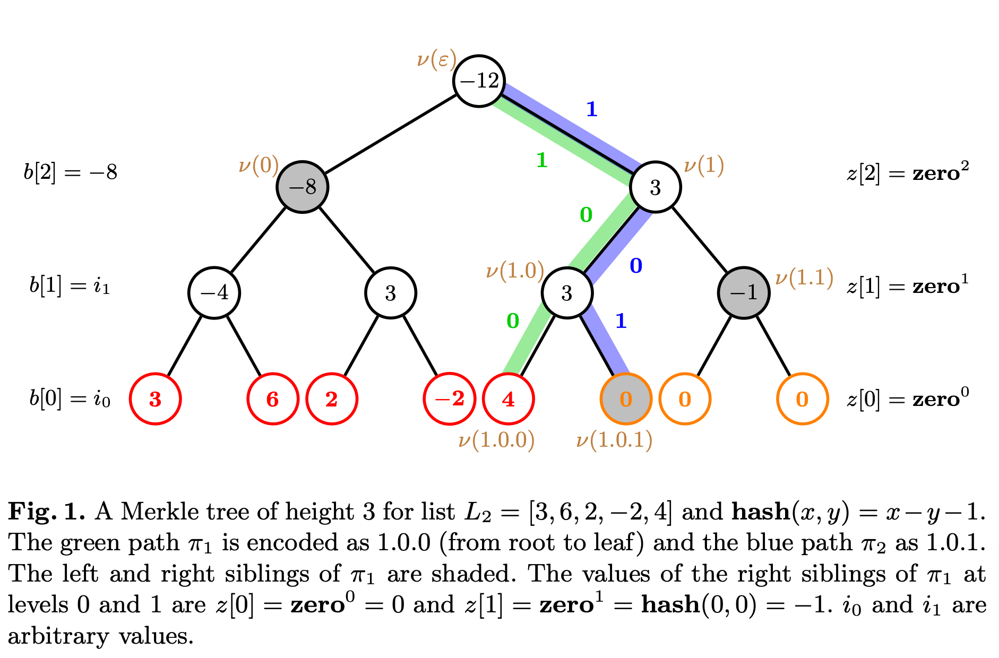
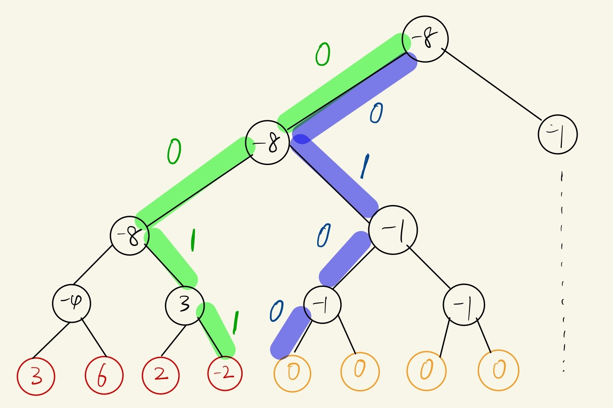

# Incremental Merkle Tree 详解

_2023-10-21_ · by zmrenwu · #Web3

## 背景

以太坊 2.0 使用权益证明（proof-of-stake）共识机制，所有参与以太坊 2.0 的节点，需要向 [智能合约 `DepositContract`][1] 质押一定量的 ETH 成为验证者（validator）。`DepositContract` 使用了所谓的 _Incremental Merkle Tree (IMT)_ 来记录验证者的质押历史。

之所以不使用常规的 Merkle Tree，是因为当新的验证者加入时，常规的 Merkle Tree 需要指数级的时间复杂度来更新整棵树，这将产生极高的 gas 费用。而 _IMT_ 则只需要线性时间和空间复杂度来记录和更新整棵树。

虽然 _IMT_ 极大地优化了 gas 费用，但相比于常规的 Merkle Tree，其数据结构和算法更为复杂，直观上不容易理解。互联网上可搜索到的讲解 _IMT_ 的资料也不多，目前我看过的最容易让人理解的论述来自论文 [Verification of the Incremental Merkle Tree Algorithm with Dafny][2]。尽管论文对问题的阐述非常清晰，但还是有一些细节需要花一定的时间仔细琢磨才能理解，这篇文章可以看做对论文中关于 _IMT_ 算法的提炼总结和对一些不容易理解的细节处的补充说明。如果想详细了解 _IMT_，推荐直接阅读原论文，但如果阅读过程中遇到困惑，这篇文章可能会进一步帮你解惑。

> **说明**
> 如无特殊需要，这篇文章中使用的定义、符号、示例、算法均搬运自论文 [Verification of the Incremental Merkle Tree Algorithm with Dafny][2]

## 定义

**Merkle Tree** 是一颗满二叉树，其叶节点为给定的哈希值，非叶节点的值为使用指定的哈希函数 $f(x, y)$ 和子节点计算的哈希值。

下图是论文中给出的一颗高度为 3 的 Merkle Tree 的例子，指定的哈希函数 $f(x, y) = x - y -1$。从左到右共有 8 个叶节点，前 5 个叶节点的值是给定的，后 3 个叶节点的值未给定，设为默认值 0。我们使用列表 `[3, 6, 2, -2, 4]` 也可以表示这颗 Merkle Tree。

如果将左孩子节点标记为 0，右孩子节点标记为 1，则从根节点到某个节点的路径可表示为由 $\{0, 1\}$ 构成的序列。例如图中从根到叶节点 `4` 的路径可表示为 `1.0.0`（绿色路径），根到叶节点 `4` 下一个节点的路径可表示为 `1.0.1`（蓝色路径）。



## 算法

当 Merkle Tree 叶节点发生改变时，根节点的值也会改变。_IMT_ 涉及的第一个问题就是如何快速计算根节点的值。

最直观而暴力的算法就是根据 Merkle Tree 的定义，从叶节点开始，逐级往上计算，直到得到根节点的值。以下是使用编程语言 Python 实现的暴力算法。

```python
TREE_HEIGHT = 32

def merkle_root(values, right, f):
    """
    根据 Merkle Tree 的定义，从叶节点开始逐级往上计算根节点的值。

    values: 叶节点值列表
    right: 右兄弟节点不存在时的默认值
    f: 哈希函数
    """
    for h in range(TREE_HEIGHT):
        if len(values) % 2 == 1:
            values = values + [right[h]]
        values = [f(values[i], values[i + 1]) for i in range(0, len(values), 2)]
    return values[0]
```

暴力算法的计算量比较大，尤其对智能合约 `DepositContract`，每当有新的验证者质押 ETH，暴力算法需要花费很高的 gas 费用重新计算 Merkle Tree 根节点的值。

除了暴力计算，我们也可以使用其它方式来计算根节点的值。给定一条从根到叶节点的路径 $P$，只要知道 $P$ 上所有节点的左右兄弟节点的值，就可以逐级往上计算出根节点的值。如果 Merkle Tree 的高度为 $h$，则所需的时间复杂度和空间复杂度均为 $O(h)$。

下面是使用 Python 编程语言实现的递归计算根节点值的算法。

```python
def init(list_):
    """返回移除最后一个元素后的新列表"""
    return list_[:-1]


def last(list_):
    """返回列表最后一个元素"""
    return list_[-1]


def first(list_):
    """返回列表第一个元素"""
    return list_[0]

def compute_root_up(p, left, right, seed, f):
    """
    根据传入的路径 p（从根到叶），路径 p 上所有节点的左兄弟节点的值 left、
    右兄弟节点的值 right 以及叶节点的值 seed，递归计算 Merkle 树的根。

    p: 路径 p（从根到叶）
    left: 路径 p 上所有节点的左兄弟节点的值
    right: 路径 p 上所有节点的右兄弟节点的值
    seed: 路径 p 上叶节点的值
    f: 哈希函数
    """

    if len(p) == 0:
        return seed

    if last(p) == 0:
        return compute_root_up(
            init(p), init(left), init(right), f(seed, last(right))
        )
    else:
        return compute_root_up(init(p), init(left), init(right), f(last(left), seed))
```

递归算法 `compute_root_up` 是 [论文][2] 中给出的实现，但显然以迭代的方式来实现更加符合上述的分析一些：

```python
def compute_root_up_iter(p, left, right, seed, f):
    root = seed
    for i in reversed(range(0, TREE_HEIGHT)):
        if p[i] == 0:
            root = f(root, right[i])
        else:
            root = f(left[i], root)

    return root
```

如果总是选择从根节点到**最新叶结点下一个节点**的路径 $P$，则右兄弟节点一定都是默认值，因此可以提前计算出右兄弟节点的值 `right`。

对于 _IMT_，叶节点只会添加而不会删除，每当添加新的叶节点，路径 $P$ 就会发生变化，左兄弟节点的值 `left` 也会发生变化。我们希望根据新加叶节点前的 `left`，计算出新加叶节点后的 `left`。

那么应该如何更新 `left` 呢？我们先来看看添加新的叶节点后，用于计算根节点值的路径 $P'$ 和从根到新加叶节点的路径 $P$（这也是新加叶节点前用于计算根节点值的路径）的关系。

如果新添加的叶节点是其父节点的左节点，那么新的用于计算根节点值的路径 $P'$ 除了叶节点外，和 $P$ 共享其它节点。即若将 $P$ 表示为 $w.0$，那么 $P'$ 可以表示为 $w.1$。$P'$ 和 $P$ 的左兄弟节点的值只在叶节点处不一样，且 $P'$ 的叶节点为右节点，其左兄弟节点就是 $P$ 的叶节点，因此只需要将原 `left` 最后一个元素的值更新为新添加的叶节点的值就可以了。

以 [定义](#定义) 中的图为例，在节点 `4` 添加前，用于计算根节点值的路径 $P$ 为 `1.0.0`，`left = [-8, *, *]`（因为只有在路径 $P$ 的 $1$ 处对应的节点才需要左兄弟节点的值，因此其它地方的值用 `*` 代替）。节点 `4` 添加后，用于计算根节点值的路径 $P'$ 为 `1.0.1`，只有叶节点处和 $P$ 不同，因此 $P'$ 其它节点左兄弟节点的值仍然是 $P$ 左兄弟节点的值，而叶节点左兄弟节点的值就是新加节点的值 4，所以 `left` 更新为 `[-8, *, 4]`。

如果新添加的叶节点是其父节点的右节点，那么新的用于计算根节点值的路径 $P'$ 的叶节点与新加叶节点（也就是 $P$ 的叶节点）一定互为某个子树的最内（最靠近对称轴）镜像节点。因此 $P$ 可表示为 $w.0.1^k$，$P'$ 可表示为 $w.1.0^k$。对于路径 $P'$ 所需的 `left`，由于 $0^k$ 这些节点均为左节点，向上计算父节点的值时只需要 `right` 即可，因此对应的 `left` 中相关的元素不需要更新。同样的 $w$ 上的节点都是共享的，因此对应的 `left` 中相关的元素也不需要更新，唯一需要更新的，就是 $1$ 处这个右节点对应的左兄弟节点的值。路径 $P'$ 的 $1$ 处这个节点对应的左兄弟节点的值，就是路径 $P$ 的 $0$ 处这个节点的值。而且 $0$ 处下的节点均为右节点，因此很容易根据原 `left` 的值计算得到 $0$ 处这个节点的值。

以下图为例，在节点 `-2` 添加前，用于计算根节点值的路径 $P$ 为 `0.0.1.1`（绿色路径），`left = [*, *, -4, 2]`。节点 `-2` 添加后，用于计算根节点值的路径 $P'$ 变为 `0.1.0.0`（蓝色路径），只需要更新 $P'$ 的 $1$ 处对应节点的左兄弟节点的值（也就是 $P$ 第二个 $0$ 处对应节点的值），可以利用路径 $P$ 的左兄弟节点 `left` 来计算这个值。具体来说就是新加叶节点的值为 -2，那么其父节点的值为 $f(2, -2) = 2 - (-2) - 1 = 3$，再往上一级得到 $f(-4, 3) = -4 - 3 - 1 = -8$，所以 `left` 更新为 `[*, -8, -4, 2]`。



下面是使用 Python 编程语言实现的递归计算新加叶节点后所需左兄弟节点的值 `left` 的算法。

```python
def insert_value(p, left, right, seed, f):
    """
    在路径 p 的叶节点处插入值为 seed 的节点，递归计算下一个节点所在路径所需的左兄弟节点的值。

    p: 待插入节点的路径（从根到叶）
    left: 路径 p 上所有节点的左兄弟节点的值
    right: 路径 p 上所有节点的右兄弟节点的值
    seed: 待插入节点的值
    f: 哈希函数
    """

    if len(p) == 1:
        return [seed] if first(p) == 0 else left

    if last(p) == 0:
        return init(left) + [seed]
    else:
        return insert_value(
            init(p), init(left), init(right), f(last(left), seed)
        ) + [last(left)]
```

递归算法 `insert_value` 是 [论文][2] 中给出的实现，但显然以迭代的方式来实现更加符合上述的分析一些。从分析中也可以发现更新 `left` 时无需用到 `right` 的信息，因此用迭代方式实现的版本中省掉了 `right` 参数：

```python
def insert_value_iter(p, left, seed, f):
    if last(p) == 0:
        left[-1] = seed
    else:
        i = TREE_HEIGHT - 1
        node = seed
        while p[i] == 1:
            node = f(left[i], node)
            i -= 1

        left[i] = node

    return left
```

因此，当新加叶节点到 Merkle Tree 时，可以调用 `insert_value` 更新 `left`；有了 `left` 后就可以调用 `compute_root_up` 计算 Merkle Tree 根节点的值。

## 代码

完整的代码在 [imt.py](./imt.py) 文件中，包含递归与非递归的实现。

[1]: https://github.com/ethereum/consensus-specs/blob/master/solidity_deposit_contract/deposit_contract.sol
[2]: https://franck44.github.io/publications/papers/merkle-fm-21.pdf
